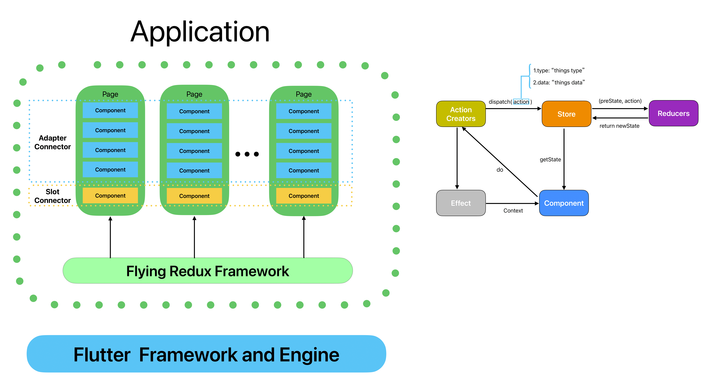

<p align="center"></p>
<!-- <h1>Flying Redux</h1> -->

[](https://github.com/GavinHome/flying-redux/actions/workflows/build.yml) [](https://codecov.io/gh/gvinhome/flying-redux)


## 简介

Flying Redux 是一个基于Redux状态管理的组装式flutter应用框架.

<p align=""></p>

它有四个特性:

> 1. 函数式编程

> 2. 可预测的状态

> 3. 插拔式的组件化

> 4. 支持null safety 和 flutter 3.x

## 如何开始

以计数器为例，仅需要5步即可使用flying redux构建应用：

> 1. 引入 flying_redux 

> 2. 创建状态类和初始化状态

> 3. 定义 Action 和 ActionCreator

> 4. 创建修改状态的 Reducer

> 5. 创建组件或页面视图以显示

```dart
import 'package:flying_redux/flying_redux.dart';

/// [State]
class PageState extends Cloneable<PageState> {
  late int count;

  @override
  PageState clone() {
    return PageState()..count = count;
  }
}

/// [InitState]
PageState initState(Map<String, dynamic>? args) {
  //just do something here...
  return PageState()..count = 0;
}

/// [Action]
enum CounterAction { increment }

/// [ActionCreator]
class CounterActionCreator {
  static Action increment() {
    return const Action(CounterAction.increment, payload: 1);
  }
}

/// [Reducer]
buildReducer() {
  return asReducer(<Object, Reducer<PageState>>{
    CounterAction.increment: _increment,
  });
}

PageState _increment(PageState state, Action action) {
  final int num = action.payload;
  return state.clone()..count = (state.count + num);
}

/// [Page]
class CountPage extends Page<PageState, Map<String, dynamic>> {
  CountPage()
      : super(
            initState: initState,
            reducer: buildReducer(),
            view: (PageState state, Dispatch dispatch, ComponentContext<PageState> ctx) {
              return Scaffold(
                body: Center(
                  child: Column(
                    mainAxisAlignment: MainAxisAlignment.center,
                    children: <Widget>[
                      const Text(
                        'You have pushed the button this many times:',
                      ),
                      Text(state.count.toString()),
                    ],
                  ),
                ),
                floatingActionButton: FloatingActionButton(
                  onPressed: () => dispatch(CounterActionCreator.increment()),
                  tooltip: 'Increment',
                  child: const Icon(Icons.add),
                ), // This trailing comma makes auto-formatting nicer for build methods.
              );
            });
}
```

## 这是一个完整的例子

如果你需要一个完整的使用例子，请参考 `/example` 文件夹中的 todo-list 示例.

-   [todo list](example) - 一个简单的待办列表示例
-   在命令行中运行:

``` dart
cd ./example
flutter run
```

### 代码模板插件

-   [Flying Redux Template For VSCode](https://github.com/GavinHome/flying-redux-template-for-vscode).
-   [Flying Redux Template For AndroidStudio](https://github.com/GavinHome/flying-redux-template-for-as).

## 其他

实际上，flying-redux的源码在命名和实现上与fish-redux基本类似。但是[fish-redux](https://github.com/alibaba/fish-redux)
太长时间不更新了，所以我基于它做了大量重构和修改，精简了很多概念，最后重新命名了它。假如你有任何问题，可以扫描下面微信二维码进去群中一起讨论.

<p align=""></p>
